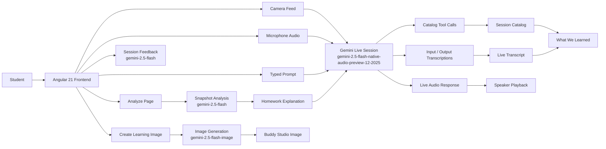

# Magic Buddy

[](https://geminiliveagentchallenge.devpost.com/)
[](https://angular.io/)
[](https://deepmind.google/technologies/gemini/)
[](https://magic-buddy-998069837739.us-central1.run.app)

Magic Buddy is a real-time AI homework tutor built for the [Gemini Live Agent Challenge](https://geminiliveagentchallenge.devpost.com/).

It is designed for children and families who want a more natural way to learn:
- talk to an AI tutor with voice
- show a worksheet, letter, number, or drawing on camera
- get guided help instead of answer dumping
- generate kid-friendly learning visuals for a topic

Magic Buddy is aimed at the `Live Agents` style of experience: live voice, live camera, multimodal understanding, and interactive tutoring in one session.

## What It Does

Magic Buddy combines five learning modes in one app:

1. `Live voice tutoring`
The student can speak to Buddy in a conversational way. Buddy greets the student, asks for their name, and continues the lesson in a warm, child-friendly tone.

2. `Camera-based homework help`
The app streams camera frames into a Gemini Live session so Buddy can react to what the child is holding up.

3. `Snapshot page analysis`
For more reliable worksheet recognition, the `Analyze Page` action captures a higher-detail frame and sends it through a separate Gemini analysis path.

4. `Learning image generation`
Students type a topic into the Buddy Studio text box and get a custom cartoonish illustration — generated independently so it never interrupts the live session.

5. `Live transcript`
Every word from the child and from Buddy streams into chat bubbles in real time, so parents and teachers can follow along or review the session.

## Why This Matters

A lot of homework tools are still text-box based. That works for adults, but not always for young students.

Magic Buddy is built around a more natural learning flow:
- the child talks
- the child shows the page
- the tutor reacts in real time
- the lesson stays encouraging and interactive

This makes the experience more suitable for early learners, reluctant readers, and mixed voice + visual homework moments.

## Core Features

- `Name-first onboarding`
Buddy starts by asking the student’s name and then uses it naturally in later replies.

- `Buddy Vision`
Detected items can be collected during the session as a simple “what we learned” catalog.

- `Analyze Page`
A manual high-detail fallback for worksheets and paper-based homework.

- `Buddy Studio`
Type a topic into the text box and click **Create Image** — Buddy generates a cartoonish educational illustration using `gemini-2.5-flash-image`, completely independent of the live session so it never interrupts the conversation.

- `Live Transcript`
Word-by-word chat bubbles stream in real time for both the student and Buddy — no waiting for the turn to end. Uses `inputAudioTranscription` and `outputAudioTranscription` from the Live API.

- `Session summary`
Generates a short encouraging recap after the session.

- `Celebration UX`
Ends sessions with a friendly success moment and confetti.

## Why Gemini Live API

Most tutoring apps use a request/response cycle: record → transcribe → send text → get text back → speak. That introduces 2–4 seconds of lag per exchange and breaks the natural flow of a conversation.

Magic Buddy uses the **Gemini Live API** (`BidiGenerateContent` WebSocket) to send raw PCM audio and JPEG video frames in real time, and receive native audio back — the same way a phone call works. This means:

- **No silence gaps** between the child's question and Buddy's reply
- **Buddy reacts to visual context** (the camera) while listening to voice at the same time
- **Word-by-word transcription** streams into the UI as Buddy speaks, not after
- **Tool calls mid-conversation** let Buddy update the UI catalog while still talking
- **Native audio output** — Buddy's voice is generated by the model, not a separate TTS step

```typescript
// Real-time audio + video + transcription + tool calling in one session
const session = await ai.live.connect({
  model: 'gemini-2.5-flash-native-audio-preview-12-2025',
  config: {
    responseModalities: [Modality.AUDIO],
    inputAudioTranscription: {},   // streams user words word-by-word
    outputAudioTranscription: {},  // streams Buddy words word-by-word
    tools: [{ functionDeclarations: [catalogItemTool] }],
    systemInstruction: { parts: [{ text: BUDDY_SYSTEM_PROMPT }] },
    speechConfig: { voiceConfig: { prebuiltVoiceConfig: { voiceName: 'Kore' } } }
  },
  callbacks: { onmessage: handleMessage }
});
```

## Architecture



## Live Flow

1. The child starts a session.
2. Buddy greets the child and asks for their name.
3. The child either:
   - asks for help with a spoken topic, or
   - shows a worksheet/page on camera.
4. Buddy responds through live audio.
5. If worksheet recognition needs a more reliable fallback, the user presses `Analyze Page`.
6. If the child needs a visual explanation, they use `Buddy Studio`.

## Tech Stack

- `Frontend`: Angular 21
- `Styling`: Tailwind CSS 4
- `AI SDK`: `@google/genai`
- `Live model`: `gemini-2.5-flash-native-audio-preview-12-2025`
- `Snapshot analysis model`: `gemini-2.5-flash`
- `Image generation model`: `gemini-2.5-flash-image`
- `Audio handling`: Web Audio API + AudioWorklet
- `Deployment target`: Google Cloud Run via Docker + Cloud Build

## Repo Structure

```text
src/
  app/
    app.ts                  # Main Angular UI (standalone component, signals, OnPush)
    gemini-live.service.ts  # Live session, audio pipeline, vision, image generation
  assets/
    pcm-processor.js        # AudioWorklet: mic → 16kHz PCM chunks
  main.server.ts
  server.ts                 # Express + Angular SSR (Cloud Run ready)
public/
  playback-processor.js     # AudioWorklet: 24kHz PCM → speaker
Dockerfile
cloudbuild.yaml
```

## Local Development

### Prerequisites

- Node.js 20+
- npm
- A Gemini API key from [Google AI Studio](https://aistudio.google.com/)

### Install

```bash
npm install
```

### Configure

```bash
cp .env.example .env.local
# Edit .env.local and set:
#   GEMINI_API_KEY=AIza...your_key_here
#   APP_URL=http://localhost:3000
```

### Run

```bash
npm run dev
```

Then open:

```text
http://localhost:3000
```

## Build

```bash
npm run build
```

## Deployment

This repo already includes:
- [Dockerfile](/Users/johnpole/Development/GeminiCodeChallenge/magic-homework-buddy/Dockerfile)
- [cloudbuild.yaml](/Users/johnpole/Development/GeminiCodeChallenge/magic-homework-buddy/cloudbuild.yaml)

That means the app is already set up for a Google Cloud Run style deployment flow.

### Cloud Build + Cloud Run

1. Create or select a Google Cloud project.
2. Enable billing, Cloud Build, and Cloud Run.
3. Set your Gemini API key as a Cloud Build substitution or secret.
4. Run:

```bash
gcloud builds submit --config cloudbuild.yaml
```

This will:
- build the container
- push the image
- deploy the service to Cloud Run

## Demo Script

Use this sequence for a stable competition demo:

1. Start the session.
2. Let Buddy ask the child’s name.
3. Say the name clearly.
4. Ask for help with a topic like:
   - `Help me with counting`
   - `Help me with vowels`
5. Hold up a worksheet and use `Analyze Page`.
6. Ask Buddy Studio for an image like:
   - `Create an image of happy vowels`
   - `Create an image for counting to 10`
7. End the session and show the summary/confetti moment.

## Competition Positioning

Magic Buddy is built to demonstrate the strengths of a Gemini-powered live agent:
- multimodal interaction
- real-time voice tutoring
- live camera understanding
- educational guidance instead of answer dumping
- child-friendly experience design

## Notes

- The app currently includes a typed fallback because voice-only browser behavior can vary by machine and environment.
- For public deployment, API-key handling should be reviewed carefully before broad sharing.
- For a competition demo, `Analyze Page` is the most reliable worksheet recognition path.

## Future Improvements

- Better turn-taking stability for noisy rooms
- More structured student progress tracking
- Parent/teacher session dashboard
- Stronger worksheet detection before manual snapshot
- More guided lesson plans by age or grade band

## Authors

- **John Krupavaram Pole Bhakthavatsalam**
- **Anoop Gundabattina**

---

*Created with ❤️ for the next generation of learners.*

Built for the [Gemini Live Agent Challenge](https://geminiliveagentchallenge.devpost.com/).
